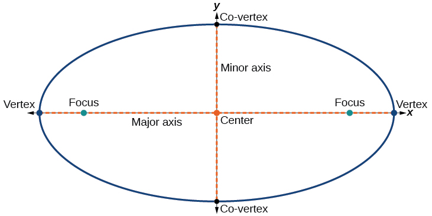

# Solar System Simulation
Simulation of our Solar System written in Python. This code has been adapted from my Astronomy Interface Project. 
When I was recreating this simulation I realized that I made an error in the calculations. 
Below is a table of values I used for simulating our solar system.

| Planet  | Perihelion (10^6 km) | Aphelion (10^6 km) | Orbital Period (days) |
|---------|----------------------|--------------------|-----------------------|
| Mercury | 46.0                 | 69.8               | 88                    |
| Venus   | 107.5                | 108.9              | 224.6                 |
| Earth   | 147.1                | 152.1              | 365.2                 |
| Mars    | 206.7                | 249.3              | 697.0                 |
| Jupiter | 740.6                | 816.4              | 4,331.0               |
| Saturn  | 1,357.6              | 1,506.5            | 10,747.0              |
| Uranus  | 2,732.7              | 3,001.4            | 30,589.0              |
| Neptune | 4,471.1              | 4,558.9            | 59,800.0              |

While there is nothing wrong with this data, taken from https://nssdc.gsfc.nasa.gov/planetary/factsheet/,
there was something wrong with how I was using the data. I knew the planet's orbits were elliptical and just 
assumed the perihelion (point in planet's orbit closest to the sun) 
and aphelion (point in a planet's orbit furthest from the sun) were the semi-minor and semi-major axis respectively,
however this is wrong.
The semi-minor axis is the shortest radius from the center of an ellipse.
The semi-major axis is the longest radius from the center of an ellipse.
The difference here is that the semi-minor/major axes are distances from the center to the perimeter, 
while the aphelion/perihelion are distances from one focus to the perimeter.
Below are the correct Semi-minor and Semi-major Axes.

| Planet  | Semi-minor Axis (10^6 km) | Semi-major Axis (10^6 km) | Orbital Eccentricity |
|---------|---------------------------|---------------------------|----------------------|
| Mercury | 56.7                      | 57.9                      | 0.206                |
| Venus   | 108.2                     | 108.2                     | 0.007                |
| Earth   | 149.6                     | 149.6                     | 0.017                |
| Mars    | 227.0                     | 228.0                     | 0.094                |
| Jupiter | 777.6                     | 778.5                     | 0.049                |
| Saturn  | 1,430.1                   | 1,432.1                   | 0.052                |
| Uranus  | 2,863.9                   | 2,867.1                   | 0.047                |
| Neptune | 4,514.8                   | 4,515.0                   | 0.010                |

You can see there is a lot less variability in the Semi-minor and Semi-major axis than there was with the perihelion and aphelion.
This is because our planets' orbits are not very elliptical. With only Mercury having above a 0.1 eccentricity. 
An eccentricity of 0 dictates a circle and an eccentricity of 1 dictates a line. 
The equation for this value is found by e = c/a:
e = eccentricity, c = focal length (distance from the center to a focus), and a = semi-major axis.
Below is a diagram of an ellipse and an explanation of how I obtained each of these values.

Note: This ellipse is very eccentric, whereas our planets orbits are not and the Foci would be very close together.
I decided to use this model for clarity.

From NASA's Planetary Fact Sheet, I knew the eccentricity, perihelion, and aphelion of each orbit. 
The perihelion is equivalent to the distance from one Focus to its closest Vertex.
This is because the sun sits at one focus, and the planet will be on the vertex.
The aphelion is equivalent to the distance from one Focus to the further Vertex. 
This would mean that the Semi-major Axis is equal to (perihelion + aphelion) / 2.
With this and one ellipse equations, we can figure out the Semi-minor Axis: e = sqrt(1 - b^2 / a^2). 
In this equation, e = eccentricity, a = the semi-major axis, and b = the semi-minor axis.
We can reformat this equation to put b on the left: b = sqrt(a^2 * (1 - e^2)).
Using these equations to calculate the semi-minor and semi-major axis, I fixed my simulation.

These equations can be found in ellipseEquations.py with a few other formulas I programmed.
I am currently working on diagrams that accurately show the two foci for each planet's orbit.
